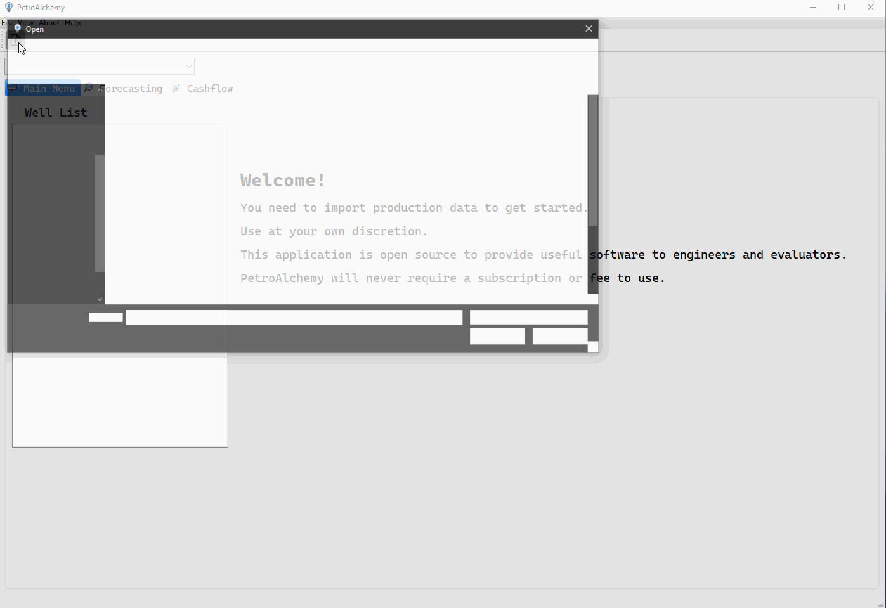

# PetroAlchemy

Open source petroleum forecasting and financial tool.

## Introduction

The PetroAlchemy project grew out of my first attempt to create an open source project for petroleum engineering called petrolpy. The vision is to create an open source desktop application with useful tools for anyone interested in petroleum evaluation. As a reservoir engineer, I wanted to build tools I would actually use. Therefore, the project is beginning with decline curve analysis and estimating cash flows for wells or groups of wells. The goal is to balance ease of use and extensibilty for advanced analysis.

PetroAlchemy is free to use and will never require you to purchase a license or pay any fees to use. If you would like to donate to the project you can do so [here](https://paypal.me/MichaelWentz).

## Installation

| System            | Download                                                                                                                                      |
| ----------------- | --------------------------------------------------------------------------------------------------------------------------------------------- |
| Windows 10 64-bit | [PetroAlchemy-0.3.0-beta-amd64.msi](https://github.com/mwentzWW/PetroAlchemy/releases/download/v0.3.0-beta/PetroAlchemy-0.3.0-beta-amd64.msi) |

## Getting Started

Refer to the current [documenation](https://petroalchemy.readthedocs.io/en/latest/tutorial.html) to get started.

This desktop application was created using [Python](https://www.python.org/) and [Qt](https://www.qt.io/). Performing decline curve analysis and running cash flows is not computationally intensive unless you are running thousands of decline curves, which at that point the code would need to be optimized for speed. As this tool is starting with a focus on analyzing a few wells at a time, Python is ideal for feature development and prototyping. Migrating the source code to the Qt framework has improved the code quality and maintainability.

If you have any issues downloading or installing PetroAlchmey you can reach me at michaelwiv@gmail.com or contact me on [LinkedIn](https://www.linkedin.com/in/mwentzww/).

## Current Features

    1. Import Excel/CSV production files
    2. Fit Arps decline curves for oil and gas
    3. Run financial cash flow on decline curves
    4. Preview monthly cash flow in application
    5. Output cash flow to excel

I have a list of features to add to the project. I want to add the ability for engineers to select several different kinds of decline curves, not just Arps hyperbolic/exponential. This application utilized the Society of Petroleum Evaluation Engineer's website and best practices for equations and discounting methodologies.

## References

- [Petroleum Engineering Handbook (SPE) Valuation of Oil and Gas Reserves](https://petrowiki.org/PEH:Valuation_of_Oil_and_Gas_Reserves)
- [SPE Decline Curve Analysis](https://petrowiki.spe.org/Production_forecasting_decline_curve_analysis)
- [Financials - SPEE Website](https://spee.org/resources/recommended-evaluation-practices-reps)
- [Fekete Decline Theory](http://www.fekete.com/san/webhelp/feketeharmony/harmony_webhelp/content/html_files/reference_material/Analysis_Method_Theory/Traditional_Decline_Theory.htm)
