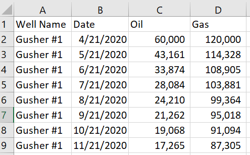
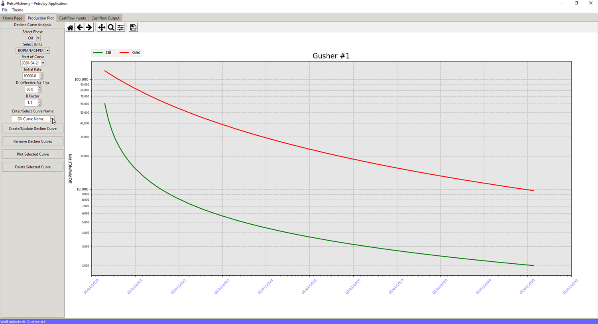
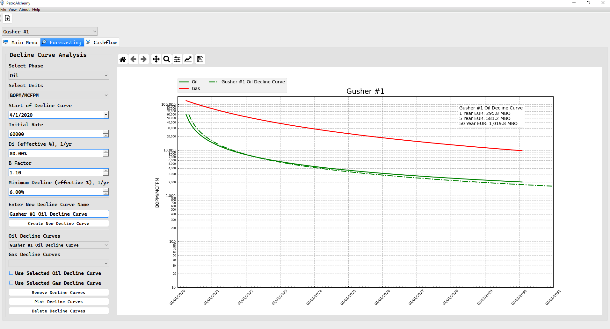
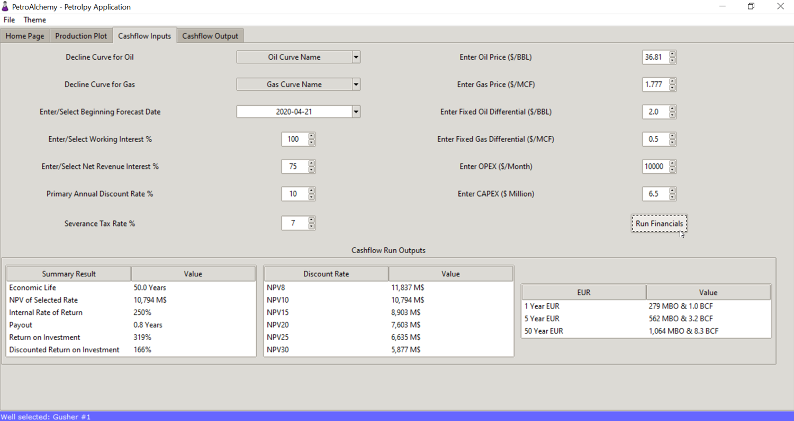

PetroAlchemy Tutorial
===========================
.. contents::

.. image:: img/preview_0.3.0-beta.gif

What is PetroAlchemy?
---------------------

PetroAlchemy is a desktop application written using python for the backend and Qt for the frontend.
Python is a very popular general purpose coding language. It is used to
create websites, machine learning models, and data science tools. If you
would like to learn more I would encourage you to go to
`python.org <https://www.python.org/>`__ and read the documentation.
Qt is a mature Graphical User Interface (GUI) framework for cross-platform development with Python or C++.

With the basic coding technical introduction aside, PetroAlchemy is
essentially a tool to import a production file for an oil or gas well
and estimate the cashflow. For reserves most people either want a type
curve or forecast for a current producing well. PetroAlchemy has the
capability to estimate economics (financials) for a type well profile
based on a current producer(s), commonly referred to as a *Type Curve*,
or it can be used to forecast production and revenue for a producing
well.

Use Case for PetroAlchemy
-------------------------

Reservoir engineers and petroleum evaluators typically use commercial
software to forecast and model well production. There are standard
software packages used to model reserves that is required for auditing,
and bank purposes. PetroAlchemy is in no way a replacement for these
commercial packages. Rather, PetroAlchemy is a tool for an evaluator to
quickly estimate or understand the order of magnitude a forecast or type
well profile might look like. For instance, an evaluator might need to
pull public production and analyze the profitability of a well, but
unless a “dummy” database is set up for this purpose it can be tedious
to perform this action.

PetroAlchemy can provide an easy way to quickly import raw data and get
an estimate in a few minutes. As with any forecast, the assumptions and
limitations must be acknowledged in the forecast output. But just
because an estimate is quick to reach does not lessen how useful the
answer might be. Knowing whether a well’s EUR (**Estimated** Ultimate
Recovery) is 100 MBO (Thousand Barrels of Oil) or 1,000 MBO is
significant, but not always easy to infer visually from historical
production.

How to get PetroAlchemy
-----------------------

The easiest way to get the latest version if you are using a Windows 64-bit
machine is to download the Windows installer from the `README 
<https://github.com/mwentzWW/PetroAlchemy>`__ installation section. If
you do not know if you are running 32-bit or 64-bit then type *about
your pc* in the Windows search bar and it should list it under **System
type**.

The Windows installer will ask you where to store the application and
the associated files. Once the installer is finished there will be a *PetroAlchemy* shortcut on your desktop. You should also be able
to search for PetroAlchemy or find the PetroAlchemy.exe file wherever
you saved it and run the application.

If you are using a Linux machine I am working on packaging for 64-bit
Linux as well. Currently I do not have an easy way to package for mac
using VirtualBox or other means. If you are interested in helping me
with that I would appreciate the input.

The alternative from using a Windows installer would be to
clone the github repository and run the python code yourself if you
already are comfortable with doing that.

How to import data
------------------

PetroAlchemy supports Excel workbooks (.xlsx) and CSV (.csv) production
files. Refer to the **data_example** folder either on github or in your
installation folder.

Currently the production file **must** use the below column format:

The column names must be *Well Name*, *Date*, *Oil*, and *Gas*. If your
data is not set up this way you will have an import error in the
application. You can import multiple wells at once if your file has more than one well in the *Well Name* column of your import file.

Once the application is running you can import your data by clicking the
**Import Well Data** button on the home page, or by clicking File >
Import Production, or clicking the icon in the toolbar. After a successful import the data is available to be
selected as the well for analysis by selecting it using the dropdown box
on the home page.

How to fit decline curves
-------------------------

You can select which well to analyze by using the dropdown box under the toolbar.

The selected well’s production will be shown on the **Forecasting**
tab. Click the tab to view the data you just imported. On the left side
of the screen you will see all of the decline curve parameters for Arps Decline. PetroAlchemy will use either an exponential, hyperbolic, or harmonic decline depending on what *B Factor* is selected. PetroAlchemy will automatically switch to exponential terminal decline based on the *minimim decline* selected. This tool is only useful if you have a reasonable
understanding of how decline curves are constructed. For a refresher on
decline curves and the equations used in PetroAlchemy refer to the
`References <https://petroalchemy.readthedocs.io/en/latest/references.html>`__.

PetroAlchemy models one decline curve or forecast at a time. First
select the phase to model (Oil or Gas), the Date you want the forecast
to start from, and then the usual Arps parameters. Note that
PetroAlchemy has filled in an estimate for the rate and Di based on the
first year of production imported.

Once your parameters have been filled in for a first look type in a
special name for the curve linked to the phase you have selected. It
will save the curve with the default name if you do not provide one.
Select *Create New Decline Curve* to save the curve model based on
the parameters and show it on the plot. Once a curve exists you have four options represented as buttons:

#. **Create New Decline Curve:** if a curve already exists and is selected this button will update the curve parameters and plot it to the graph
#. **Remove Decline Curves:** removes the decline curves from the plot, but **does not** delete them. This button is to clear the plot if too many curves are plotted.
#. **Plot Decline Curves:** this will add the selected curves in the two comboboxes if the checkboxes are also checked to the plot.
#. **Delete Decline Curves:** this will **delete** the selected curves in the two comboboxes if the checkboxes are also checked from the application.

How to run financials for a well using decline curves
-----------------------------------------------------

Once a curve has been saved for an oil and gas phase, a cashflow using
the forecasts can be created. Select the *Cashflow* tab to see
the economic input options. Any curve saved can be selected to be used
for the cashflow using the dropdowns. The key inputs for any petroleum
evaluation cash flow can be entered. If any of the terms are unfamiliar
look back to the references previously provided.

Currently the prices, operating expense (OPEX), and capital
expense (CAPEX) are static and can not change by month. The prices and
OPEX will be used for every month’s calculation of income. The CAPEX is
applied in the first month as one lump sum.

Once you have changed the Cashflow Input parameters however you like,
select the **Create Cashflow** button. The current outputs are not
any standard, but outputs I would like to see when running a cash flow.

How to save financial cash flow output
--------------------------------------

You can save the entire cashflow output run to excel by selecting **File
> Export Cashflow**. Once exported to excel it is easy to use a pivot
table to change or alter the data in how you would like to see it.

Looking forward
---------------

This project is something I have wanted to launch for a while. Petroleum
engineers need more open source options to help learn different aspects
of the industry. Engineers also might not have access to commercial
licenses for software used in decline curve analysis. My goal is to
provide tools through open source that will improve with community
contributions and feedback. 

In my view PetroAlchemy is one of many tools that will be created by the
petroleum open source community. If you have ideas for PetroAlchemy
please create a new issue with a feature request on the project’s
github.
